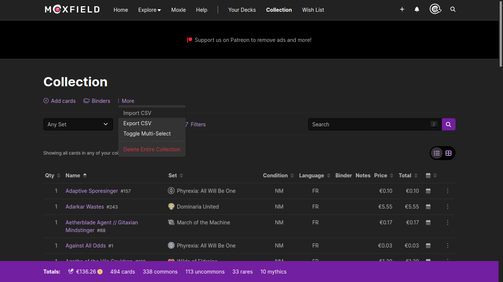

# BIMF - BulkImporter for MoxField

Unofficial Moxfield tool to import multiple cards from a single MTG set.

Working app can be found [here](https://vredeza.github.io/bimf/).

## Fill in cards

- 1 : MTG set field, fill with the set code according to [Scryfall's syntax](https://scryfall.com/docs/syntax)
- 2 : the language in which the cards will appear in your collection. **Cards name will still appear in english in BIMF**
- 3 : the amount of normal/foil cards
- 4 : button to download a .csv fils containing cards data, ready to be imported in Moxfield

## Import to Moxfield

In the [collection tab](https://www.moxfield.com/collection), you can find the *import CSV* button. There, you can put the .csv file generated by BIMF.

- all card are defaulted to *near-mint* condition
- the date in moxfield collection will be the one at the time of the download
- it might not work as much with older, weirder set